# ER Diagram: Train Recorder

## Entity Relationships

```mermaid
erDiagram
    TrainingPlan ||--o{ TrainingDay : "has training days"
    TrainingDay ||--o{ TrainingDayExercise : "contains exercises"
    Exercise ||--o{ TrainingDayExercise : "used in"
    TrainingDayExercise ||--o{ TrainingDaySetConfig : "custom mode sets"

    WorkoutSession }o--o| TrainingPlan : "based on plan"
    WorkoutSession ||--o{ WorkoutExercise : "contains"
    WorkoutExercise }o--|| Exercise : "instance of"
    WorkoutExercise ||--o{ ExerciseSet : "has sets"

    WorkoutSession ||--o| WorkoutFeeling : "has feeling"
    WorkoutFeeling ||--o{ ExerciseFeeling : "per-exercise feeling"

    Exercise ||--o| PersonalRecord : "has PR"
    Exercise ||--o| WeightSuggestion : "has suggestion"

    OtherSportType ||--o{ OtherSportMetric : "has metrics"
    OtherSportType ||--o{ OtherSportRecord : "has records"
    OtherSportRecord ||--o{ OtherSportMetricValue : "has values"
    OtherSportMetric ||--o{ OtherSportMetricValue : "recorded in"

    TrainingPlan {
        text id PK "主键 UUID"
        text display_name "计划名称"
        text plan_mode "infinite_loop / fixed_cycle"
        integer cycle_length "周期长度(周), 仅 fixed_cycle"
        text schedule_mode "weekly_fixed / fixed_interval"
        integer interval_days "间隔天数(0-6), 仅 fixed_interval"
        integer is_active "当前激活计划 0/1"
        text created_at "ISO 8601 创建时间"
        text updated_at "ISO 8601 更新时间"
    }

    TrainingDay {
        text id PK "主键 UUID"
        text plan_id "所属训练计划 ID"
        text display_name "训练日名称(推日/拉日/蹲日/自定义)"
        text day_type "push/pull/legs/custom"
        integer order_index "训练日顺序"
        text created_at "ISO 8601"
        text updated_at "ISO 8601"
    }

    TrainingDayExercise {
        text id PK "主键 UUID"
        text training_day_id "所属训练日 ID"
        text exercise_id "关联动作 ID"
        integer order_index "动作顺序"
        text exercise_mode "fixed=统一参数 / custom=逐组设置"
        integer target_sets "目标组数(1-10)"
        integer target_reps "目标次数(1-30), fixed 模式"
        real start_weight "初始重量(kg)"
        text note "备注, 如 暂停深蹲"
        integer rest_seconds "组间休息(秒)"
        real weight_increment "加重增量(kg), 继承自 exercise"
        text created_at "ISO 8601"
        text updated_at "ISO 8601"
    }

    TrainingDaySetConfig {
        text id PK "主键 UUID"
        text day_exercise_id "所属训练日动作 ID"
        integer set_index "组序号(0-based)"
        integer target_reps "该组目标次数"
        real target_weight "该组目标重量(kg)"
    }

    Exercise {
        text id PK "主键 UUID"
        text display_name "动作名称"
        text category "分类: core/upper_push/upper_pull/lower/abs_core/shoulder/custom"
        real weight_increment "加重增量(kg)"
        integer default_rest "默认组间休息(秒), 30-600"
        integer is_custom "0=预置, 1=用户自定义"
        text created_at "ISO 8601"
        text updated_at "ISO 8601"
    }

    WorkoutSession {
        text id PK "主键 UUID"
        text plan_id "所属训练计划 ID, 补录可为空"
        text training_day_id "训练日定义 ID"
        text record_date "训练日期(yyyy-MM-dd)"
        text training_type "push/pull/legs/other"
        text workout_status "in_progress/completed/completed_partial"
        text started_at "开始时间 ISO 8601"
        text ended_at "结束时间 ISO 8601"
        integer is_backfill "是否补录 0/1"
        text created_at "ISO 8601"
        text updated_at "ISO 8601"
    }

    WorkoutExercise {
        text id PK "主键 UUID"
        text workout_session_id "所属训练会话 ID"
        text exercise_id "关联动作 ID"
        integer order_index "执行顺序"
        text note "备注"
        real suggested_weight "建议重量(kg)"
        integer is_custom_weight "是否使用自定义重量 0/1"
        integer target_sets "目标组数"
        integer target_reps "目标次数(fixed 模式)"
        text exercise_mode "fixed / custom"
        text exercise_status "pending/in_progress/completed/skipped"
        text created_at "ISO 8601"
        text updated_at "ISO 8601"
    }

    ExerciseSet {
        text id PK "主键 UUID"
        text workout_exercise_id "所属训练动作 ID"
        integer set_index "组序号(0-based)"
        real target_weight "目标重量(kg)"
        real actual_weight "实际重量(kg)"
        integer target_reps "目标次数"
        integer actual_reps "实际次数, NULL=未完成"
        integer is_completed "0=未完成, 1=已完成"
        text rest_started_at "休息开始时间 ISO 8601"
        integer rest_duration "休息时长(秒)"
        text created_at "ISO 8601"
        text updated_at "ISO 8601"
    }

    WorkoutFeeling {
        text id PK "主键 UUID"
        text workout_session_id "所属训练会话 ID(UNIQUE)"
        integer fatigue_level "疲劳度(1-10), 默认 5"
        integer satisfaction_level "满意度(1-10), 默认 5"
        text notes "整体备注, max 500 字"
        text created_at "ISO 8601"
        text updated_at "ISO 8601"
    }

    ExerciseFeeling {
        text id PK "主键 UUID"
        text workout_feeling_id "所属训练感受 ID"
        text exercise_id "关联动作 ID"
        text notes "动作备注, max 200 字"
        text created_at "ISO 8601"
        text updated_at "ISO 8601"
    }

    PersonalRecord {
        text id PK "主键 UUID"
        text exercise_id "关联动作 ID(UNIQUE)"
        real max_weight "最高重量(kg)"
        real max_volume "最高容量(kg)"
        text max_weight_date "最高重量达成日期"
        text max_volume_date "最高容量达成日期"
        text max_weight_session_id "最高重量对应的训练 ID"
        text max_volume_session_id "最高容量对应的训练 ID"
        text created_at "ISO 8601"
        text updated_at "ISO 8601"
    }

    WeightSuggestion {
        text id PK "主键 UUID"
        text exercise_id "关联动作 ID(UNIQUE)"
        real suggested_weight "建议重量(kg), NULL=首次无历史"
        text based_on_session_id "基于哪次训练 ID"
        integer consecutive_completions "连续完成次数"
        integer consecutive_failures "连续未完成次数"
        text last_calculated_at "最后计算时间"
        text created_at "ISO 8601"
        text updated_at "ISO 8601"
    }

    BodyMeasurement {
        text id PK "主键 UUID"
        text record_date "记录日期(yyyy-MM-dd)"
        real body_weight "体重(kg), 精确到 0.1"
        real chest "胸围(cm)"
        real waist "腰围(cm)"
        real arm "臂围(cm)"
        real thigh "大腿围(cm)"
        text notes "备注, max 200 字"
        text created_at "ISO 8601"
        text updated_at "ISO 8601"
    }

    OtherSportType {
        text id PK "主键 UUID"
        text display_name "运动名称"
        integer is_custom "0=预设, 1=自定义"
        text created_at "ISO 8601"
        text updated_at "ISO 8601"
    }

    OtherSportMetric {
        text id PK "主键 UUID"
        text sport_type_id "所属运动类型 ID"
        text metric_name "指标显示名称"
        text metric_key "指标程序键(distance/time/pace/...)"
        text input_type "number / text"
        integer is_required "是否必填 0/1"
        text unit "单位(m/km/min/bpm/kcal)"
        text created_at "ISO 8601"
        text updated_at "ISO 8601"
    }

    OtherSportRecord {
        text id PK "主键 UUID"
        text sport_type_id "运动类型 ID"
        text record_date "记录日期(yyyy-MM-dd)"
        text notes "备注"
        text created_at "ISO 8601"
        text updated_at "ISO 8601"
    }

    OtherSportMetricValue {
        text id PK "主键 UUID"
        text sport_record_id "所属运动记录 ID"
        text metric_id "指标定义 ID"
        text metric_value "指标值(统一存为文本)"
        text created_at "ISO 8601"
        text updated_at "ISO 8601"
    }

    TimerState {
        text id PK "主键 UUID"
        text workout_session_id "当前训练会话 ID"
        text start_timestamp "计时开始时间戳 ISO 8601"
        integer total_duration_seconds "总时长(秒)"
        integer is_running "是否正在运行 0/1"
        text updated_at "ISO 8601"
    }

    UserSettings {
        text id PK "主键 UUID"
        text weight_unit "kg / lb"
        integer default_rest_seconds "默认休息时间(秒)"
        integer training_reminder_enabled "训练提醒 0/1"
        integer vibration_enabled "振动提醒 0/1"
        integer sound_enabled "声音提醒 0/1"
        integer onboarding_completed "是否完成引导 0/1"
        text updated_at "ISO 8601"
    }
```

## Entity Details

### Exercise [NEW]

| Column | Type | Constraints | Description |
|--------|------|-------------|-------------|
| id | TEXT | PK, NOT NULL | 主键 UUID |
| display_name | TEXT | NOT NULL, UNIQUE | 动作名称 |
| category | TEXT | NOT NULL | 分类: core/upper_push/upper_pull/lower/abs_core/shoulder/custom |
| weight_increment | REAL | NOT NULL | 加重增量 (kg) |
| default_rest | INTEGER | NOT NULL | 默认组间休息 (秒), 30-600 |
| is_custom | INTEGER | NOT NULL, DEFAULT 0 | 0=预置, 1=用户自定义 |
| created_at | TEXT | NOT NULL | ISO 8601 创建时间 |
| updated_at | TEXT | NOT NULL | ISO 8601 更新时间 |

### TrainingPlan [NEW]

| Column | Type | Constraints | Description |
|--------|------|-------------|-------------|
| id | TEXT | PK, NOT NULL | 主键 UUID |
| display_name | TEXT | NOT NULL | 计划名称 |
| plan_mode | TEXT | NOT NULL | infinite_loop / fixed_cycle |
| cycle_length | INTEGER | NULL | 周期长度 (周), 仅 fixed_cycle |
| schedule_mode | TEXT | NOT NULL | weekly_fixed / fixed_interval |
| interval_days | INTEGER | NULL | 间隔天数 (0-6), 仅 fixed_interval |
| is_active | INTEGER | NOT NULL, DEFAULT 0 | 当前激活计划 0/1 |
| created_at | TEXT | NOT NULL | ISO 8601 |
| updated_at | TEXT | NOT NULL | ISO 8601 |

### TrainingDay [NEW]

| Column | Type | Constraints | Description |
|--------|------|-------------|-------------|
| id | TEXT | PK, NOT NULL | 主键 UUID |
| plan_id | TEXT | NOT NULL | 所属训练计划 ID (应用层维护引用完整性) |
| display_name | TEXT | NOT NULL | 训练日名称 (推日/拉日/蹲日/自定义) |
| day_type | TEXT | NOT NULL | push/pull/legs/custom |
| order_index | INTEGER | NOT NULL | 训练日顺序 |
| created_at | TEXT | NOT NULL | ISO 8601 |
| updated_at | TEXT | NOT NULL | ISO 8601 |

### TrainingDayExercise [NEW]

| Column | Type | Constraints | Description |
|--------|------|-------------|-------------|
| id | TEXT | PK, NOT NULL | 主键 UUID |
| training_day_id | TEXT | NOT NULL | 所属训练日 ID |
| exercise_id | TEXT | NOT NULL | 关联动作 ID |
| order_index | INTEGER | NOT NULL | 动作顺序 |
| exercise_mode | TEXT | NOT NULL, DEFAULT 'fixed' | fixed=统一参数 / custom=逐组设置 |
| target_sets | INTEGER | NOT NULL | 目标组数 (1-10) |
| target_reps | INTEGER | NOT NULL | 目标次数 (1-30), fixed 模式 |
| start_weight | REAL | NULL | 初始重量 (kg) |
| note | TEXT | NULL | 备注, 如"暂停深蹲" |
| rest_seconds | INTEGER | NOT NULL | 组间休息 (秒) |
| weight_increment | REAL | NOT NULL | 加重增量 (kg), 继承自 Exercise |
| created_at | TEXT | NOT NULL | ISO 8601 |
| updated_at | TEXT | NOT NULL | ISO 8601 |

### TrainingDaySetConfig [NEW]

| Column | Type | Constraints | Description |
|--------|------|-------------|-------------|
| id | TEXT | PK, NOT NULL | 主键 UUID |
| day_exercise_id | TEXT | NOT NULL | 所属训练日动作 ID |
| set_index | INTEGER | NOT NULL | 组序号 (0-based) |
| target_reps | INTEGER | NOT NULL | 该组目标次数 |
| target_weight | REAL | NOT NULL | 该组目标重量 (kg) |

### WorkoutSession [NEW]

| Column | Type | Constraints | Description |
|--------|------|-------------|-------------|
| id | TEXT | PK, NOT NULL | 主键 UUID |
| plan_id | TEXT | NULL | 所属训练计划 ID (补录可为空) |
| training_day_id | TEXT | NULL | 训练日定义 ID |
| record_date | TEXT | NOT NULL | 训练日期 (yyyy-MM-dd) |
| training_type | TEXT | NOT NULL | push/pull/legs/other |
| workout_status | TEXT | NOT NULL, DEFAULT 'in_progress' | in_progress/completed/completed_partial |
| started_at | TEXT | NULL | 开始时间 ISO 8601 |
| ended_at | TEXT | NULL | 结束时间 ISO 8601 |
| is_backfill | INTEGER | NOT NULL, DEFAULT 0 | 是否补录 0/1 |
| created_at | TEXT | NOT NULL | ISO 8601 |
| updated_at | TEXT | NOT NULL | ISO 8601 |

### WorkoutExercise [NEW]

| Column | Type | Constraints | Description |
|--------|------|-------------|-------------|
| id | TEXT | PK, NOT NULL | 主键 UUID |
| workout_session_id | TEXT | NOT NULL | 所属训练会话 ID |
| exercise_id | TEXT | NOT NULL | 关联动作 ID |
| order_index | INTEGER | NOT NULL | 执行顺序 |
| note | TEXT | NULL | 备注 |
| suggested_weight | REAL | NULL | 建议重量 (kg) |
| is_custom_weight | INTEGER | NOT NULL, DEFAULT 0 | 是否使用自定义重量 0/1 |
| target_sets | INTEGER | NOT NULL | 目标组数 |
| target_reps | INTEGER | NOT NULL | 目标次数 (fixed 模式) |
| exercise_mode | TEXT | NOT NULL | fixed / custom |
| exercise_status | TEXT | NOT NULL, DEFAULT 'pending' | pending/in_progress/completed/skipped |
| created_at | TEXT | NOT NULL | ISO 8601 |
| updated_at | TEXT | NOT NULL | ISO 8601 |

### ExerciseSet [NEW]

| Column | Type | Constraints | Description |
|--------|------|-------------|-------------|
| id | TEXT | PK, NOT NULL | 主键 UUID |
| workout_exercise_id | TEXT | NOT NULL | 所属训练动作 ID |
| set_index | INTEGER | NOT NULL | 组序号 (0-based) |
| target_weight | REAL | NOT NULL | 目标重量 (kg) |
| actual_weight | REAL | NOT NULL | 实际重量 (kg) |
| target_reps | INTEGER | NOT NULL | 目标次数 |
| actual_reps | INTEGER | NULL | 实际次数, NULL=未完成 |
| is_completed | INTEGER | NOT NULL, DEFAULT 0 | 0=未完成, 1=已完成 |
| rest_started_at | TEXT | NULL | 休息开始时间 ISO 8601 |
| rest_duration | INTEGER | NULL | 休息时长 (秒) |
| created_at | TEXT | NOT NULL | ISO 8601 |
| updated_at | TEXT | NOT NULL | ISO 8601 |

### WorkoutFeeling [NEW]

| Column | Type | Constraints | Description |
|--------|------|-------------|-------------|
| id | TEXT | PK, NOT NULL | 主键 UUID |
| workout_session_id | TEXT | NOT NULL, UNIQUE | 所属训练会话 ID (一对一) |
| fatigue_level | INTEGER | NOT NULL, DEFAULT 5 | 疲劳度 1-10 |
| satisfaction_level | INTEGER | NOT NULL, DEFAULT 5 | 满意度 1-10 |
| notes | TEXT | NULL | 整体备注, max 500 字 |
| created_at | TEXT | NOT NULL | ISO 8601 |
| updated_at | TEXT | NOT NULL | ISO 8601 |

### ExerciseFeeling [NEW]

| Column | Type | Constraints | Description |
|--------|------|-------------|-------------|
| id | TEXT | PK, NOT NULL | 主键 UUID |
| workout_feeling_id | TEXT | NOT NULL | 所属训练感受 ID |
| exercise_id | TEXT | NOT NULL | 关联动作 ID |
| notes | TEXT | NULL | 动作备注, max 200 字 |
| created_at | TEXT | NOT NULL | ISO 8601 |
| updated_at | TEXT | NOT NULL | ISO 8601 |

### PersonalRecord [NEW]

| Column | Type | Constraints | Description |
|--------|------|-------------|-------------|
| id | TEXT | PK, NOT NULL | 主键 UUID |
| exercise_id | TEXT | NOT NULL, UNIQUE | 关联动作 ID (每动作一条) |
| max_weight | REAL | NOT NULL | 最高重量 (kg) |
| max_volume | REAL | NOT NULL | 最高容量 (kg) |
| max_weight_date | TEXT | NOT NULL | 最高重量达成日期 |
| max_volume_date | TEXT | NOT NULL | 最高容量达成日期 |
| max_weight_session_id | TEXT | NOT NULL | 最高重量对应的训练 ID |
| max_volume_session_id | TEXT | NOT NULL | 最高容量对应的训练 ID |
| created_at | TEXT | NOT NULL | ISO 8601 |
| updated_at | TEXT | NOT NULL | ISO 8601 |

### WeightSuggestion [NEW]

| Column | Type | Constraints | Description |
|--------|------|-------------|-------------|
| id | TEXT | PK, NOT NULL | 主键 UUID |
| exercise_id | TEXT | NOT NULL, UNIQUE | 关联动作 ID (每动作一条缓存) |
| suggested_weight | REAL | NULL | 建议重量 (kg), NULL=首次无历史 |
| based_on_session_id | TEXT | NULL | 基于哪次训练 ID |
| consecutive_completions | INTEGER | NOT NULL, DEFAULT 0 | 连续完成次数 |
| consecutive_failures | INTEGER | NOT NULL, DEFAULT 0 | 连续未完成次数 |
| last_calculated_at | TEXT | NOT NULL | 最后计算时间 |
| created_at | TEXT | NOT NULL | ISO 8601 |
| updated_at | TEXT | NOT NULL | ISO 8601 |

### BodyMeasurement [NEW]

| Column | Type | Constraints | Description |
|--------|------|-------------|-------------|
| id | TEXT | PK, NOT NULL | 主键 UUID |
| record_date | TEXT | NOT NULL | 记录日期 (yyyy-MM-dd) |
| body_weight | REAL | NULL | 体重 (kg), 精确到 0.1 |
| chest | REAL | NULL | 胸围 (cm) |
| waist | REAL | NULL | 腰围 (cm) |
| arm | REAL | NULL | 臂围 (cm) |
| thigh | REAL | NULL | 大腿围 (cm) |
| notes | TEXT | NULL | 备注, max 200 字 |
| created_at | TEXT | NOT NULL | ISO 8601 |
| updated_at | TEXT | NOT NULL | ISO 8601 |

### OtherSportType [NEW]

| Column | Type | Constraints | Description |
|--------|------|-------------|-------------|
| id | TEXT | PK, NOT NULL | 主键 UUID |
| display_name | TEXT | NOT NULL, UNIQUE | 运动名称 |
| is_custom | INTEGER | NOT NULL, DEFAULT 0 | 0=预设, 1=自定义 |
| created_at | TEXT | NOT NULL | ISO 8601 |
| updated_at | TEXT | NOT NULL | ISO 8601 |

### OtherSportMetric [NEW]

| Column | Type | Constraints | Description |
|--------|------|-------------|-------------|
| id | TEXT | PK, NOT NULL | 主键 UUID |
| sport_type_id | TEXT | NOT NULL | 所属运动类型 ID |
| metric_name | TEXT | NOT NULL | 指标显示名称 |
| metric_key | TEXT | NOT NULL | 指标程序键 (distance/time/pace/laps/hr/calories/custom) |
| input_type | TEXT | NOT NULL, DEFAULT 'number' | number / text |
| is_required | INTEGER | NOT NULL, DEFAULT 0 | 是否必填 0/1 |
| unit | TEXT | NULL | 单位 (m/km/min/bpm/kcal) |
| created_at | TEXT | NOT NULL | ISO 8601 |
| updated_at | TEXT | NOT NULL | ISO 8601 |

### OtherSportRecord [NEW]

| Column | Type | Constraints | Description |
|--------|------|-------------|-------------|
| id | TEXT | PK, NOT NULL | 主键 UUID |
| sport_type_id | TEXT | NOT NULL | 运动类型 ID |
| record_date | TEXT | NOT NULL | 记录日期 (yyyy-MM-dd) |
| notes | TEXT | NULL | 备注 |
| created_at | TEXT | NOT NULL | ISO 8601 |
| updated_at | TEXT | NOT NULL | ISO 8601 |

### OtherSportMetricValue [NEW]

| Column | Type | Constraints | Description |
|--------|------|-------------|-------------|
| id | TEXT | PK, NOT NULL | 主键 UUID |
| sport_record_id | TEXT | NOT NULL | 所属运动记录 ID |
| metric_id | TEXT | NOT NULL | 指标定义 ID |
| metric_value | TEXT | NOT NULL | 指标值 (统一存为文本) |
| created_at | TEXT | NOT NULL | ISO 8601 |
| updated_at | TEXT | NOT NULL | ISO 8601 |

### TimerState [NEW]

| Column | Type | Constraints | Description |
|--------|------|-------------|-------------|
| id | TEXT | PK, NOT NULL | 主键 UUID |
| workout_session_id | TEXT | NOT NULL | 当前训练会话 ID |
| start_timestamp | TEXT | NOT NULL | 计时开始时间戳 ISO 8601 |
| total_duration_seconds | INTEGER | NOT NULL | 总倒计时时长 (秒) |
| is_running | INTEGER | NOT NULL, DEFAULT 1 | 是否正在运行 0/1 |
| updated_at | TEXT | NOT NULL | ISO 8601 |

### UserSettings [NEW]

| Column | Type | Constraints | Description |
|--------|------|-------------|-------------|
| id | TEXT | PK, NOT NULL | 主键 UUID |
| weight_unit | TEXT | NOT NULL, DEFAULT 'kg' | 重量单位 kg / lb |
| default_rest_seconds | INTEGER | NOT NULL, DEFAULT 180 | 默认休息时间 (秒) |
| training_reminder_enabled | INTEGER | NOT NULL, DEFAULT 1 | 训练提醒 0/1 |
| vibration_enabled | INTEGER | NOT NULL, DEFAULT 1 | 振动提醒 0/1 |
| sound_enabled | INTEGER | NOT NULL, DEFAULT 0 | 声音提醒 0/1 |
| onboarding_completed | INTEGER | NOT NULL, DEFAULT 0 | 是否完成引导 0/1 |
| updated_at | TEXT | NOT NULL | ISO 8601 |

## Index Design

| Table | Index Name | Columns | Type | Description |
|-------|------------|---------|------|-------------|
| TrainingDay | idx_training_day_plan | plan_id | B-tree | 查询计划下的训练日 |
| TrainingDayExercise | idx_day_exercise_day | training_day_id | B-tree | 查询训练日的动作列表 |
| TrainingDayExercise | idx_day_exercise_exercise | exercise_id | B-tree | 检查动作是否被计划使用 |
| TrainingDaySetConfig | idx_set_config_exercise | day_exercise_id | B-tree | 查询自定义模式的逐组设置 |
| WorkoutSession | idx_workout_date | record_date | B-tree | 按日期查询训练记录 |
| WorkoutSession | idx_workout_type_date | training_type, record_date | B-tree | 按类型+日期范围筛选 |
| WorkoutSession | idx_workout_plan | plan_id | B-tree | 查询计划下的训练记录 |
| WorkoutExercise | idx_workout_exercise_session | workout_session_id | B-tree | 查询训练的动作列表 |
| WorkoutExercise | idx_workout_exercise_exercise | exercise_id | B-tree | 查询动作的训练历史 |
| ExerciseSet | idx_set_workout_exercise | workout_exercise_id, set_index | B-tree | 查询动作的组数据 |
| WorkoutFeeling | idx_feeling_session | workout_session_id | UNIQUE | 一对一关联 |
| ExerciseFeeling | idx_exercise_feeling | workout_feeling_id | B-tree | 查询训练感受的动作备注 |
| PersonalRecord | idx_pr_exercise | exercise_id | UNIQUE | 每个动作一条 PR |
| WeightSuggestion | idx_suggestion_exercise | exercise_id | UNIQUE | 每个动作一条缓存 |
| BodyMeasurement | idx_body_date | record_date | B-tree | 按日期查询+排序 |
| OtherSportRecord | idx_sport_record_date | record_date | B-tree | 按日期查询 |
| OtherSportRecord | idx_sport_record_type | sport_type_id | B-tree | 按类型查询 |
| OtherSportMetric | idx_sport_metric_type | sport_type_id | B-tree | 查询运动类型的指标 |

## Relationships

| From | To | Cardinality | Business Meaning | Integrity |
|------|----|-------------|------------------|-----------|
| TrainingPlan | TrainingDay | one-to-many | 一个计划包含多个训练日 | 应用层级联删除 |
| TrainingDay | TrainingDayExercise | one-to-many | 一个训练日包含多个动作 | 应用层级联删除 |
| Exercise | TrainingDayExercise | one-to-many | 一个动作可被多个训练日使用 | 应用层阻止删除使用中的动作 |
| TrainingDayExercise | TrainingDaySetConfig | one-to-many | 自定义模式下逐组设置 | 应用层级联删除 |
| WorkoutSession | WorkoutExercise | one-to-many | 一次训练包含多个动作实例 | 应用层级联删除 |
| WorkoutExercise | ExerciseSet | one-to-many | 一个动作实例包含多组记录 | 应用层级联删除 |
| WorkoutSession | WorkoutFeeling | one-to-one | 一次训练对应一条感受 | 应用层级联删除 |
| WorkoutFeeling | ExerciseFeeling | one-to-many | 感受包含各动作的独立备注 | 应用层级联删除 |
| Exercise | PersonalRecord | one-to-one | 每个动作维护一条 PR 记录 | 应用层级联删除 |
| Exercise | WeightSuggestion | one-to-one | 每个动作维护一条加重建议缓存 | 应用层级联删除 |
| OtherSportType | OtherSportMetric | one-to-many | 一个运动类型有多个指标配置 | 应用层级联删除 |
| OtherSportType | OtherSportRecord | one-to-many | 一个运动类型有多条记录 | 应用层阻止删除使用中的类型 |
| OtherSportRecord | OtherSportMetricValue | one-to-many | 一条记录包含多个指标值 | 应用层级联删除 |
| OtherSportMetric | OtherSportMetricValue | one-to-many | 一个指标被多次记录 | 应用层阻止删除使用中的指标 |
| WorkoutSession | TimerState | one-to-one | 当前训练的计时器状态 | 应用层级联删除 |

## Schedule Computation

日历排期不从数据库直接读取, 而是根据以下数据实时计算:

1. **输入**: TrainingPlan.schedule_mode + TrainingDay.order_index + WorkoutSession.record_date
2. **weekly_fixed 模式**: 从计划创建日期开始, 按周重复固定训练日
3. **fixed_interval 模式**: 从计划创建日期开始, 按 TrainingDay 顺序和间隔天数循环
4. **已完成的训练**: 从 WorkoutSession 记录推断 (覆写计划排期的状态)
5. **跳过/调整**: 训练记录的 workout_status 和 record_date 反映实际执行情况

计算逻辑封装在 ScheduleCalculator 类中, 输入日期范围返回该范围内每天的类型和状态。
