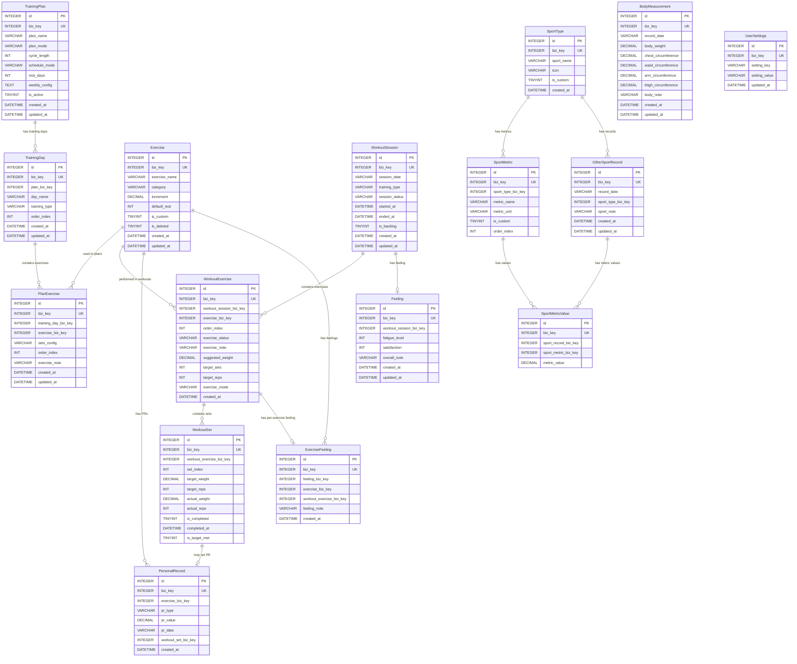

# ER Diagram: Train Recorder

## Entity Relationships



## Entity Details

### TrainingPlan [NEW]

| Column | Type | Constraints | Description |
|--------|------|-------------|-------------|
| id | INTEGER | PK, NOT NULL, AUTOINCREMENT | 主键 |
| biz_key | INTEGER | NOT NULL, UNIQUE | 雪花算法业务键 |
| plan_name | VARCHAR(100) | NOT NULL | 计划名称，如「推拉蹲 3日循环」 |
| plan_mode | VARCHAR(20) | NOT NULL | 'fixed_cycle' 或 'infinite_loop' |
| cycle_length | INT | NULL | 周期周数，仅 fixed_cycle 模式 |
| schedule_mode | VARCHAR(20) | NOT NULL | 'weekly_fixed' 或 'fixed_interval' |
| rest_days | INT | NOT NULL, DEFAULT 1 | 固定间隔模式的休息天数 (0-6) |
| weekly_config | TEXT | NULL | JSON：星期→training_day_biz_key 映射 |
| is_active | TINYINT | NOT NULL, DEFAULT 0 | 同一时间只有一个激活计划 |
| created_at | DATETIME | NOT NULL | 创建时间 |
| updated_at | DATETIME | NOT NULL | 更新时间 |

### TrainingDay [NEW]

| Column | Type | Constraints | Description |
|--------|------|-------------|-------------|
| id | INTEGER | PK, NOT NULL, AUTOINCREMENT | 主键 |
| biz_key | INTEGER | NOT NULL, UNIQUE | 雪花算法业务键 |
| plan_biz_key | INTEGER | NOT NULL | 关联 TrainingPlan.biz_key |
| day_name | VARCHAR(50) | NOT NULL | 显示名称，如「推日」 |
| training_type | VARCHAR(20) | NOT NULL | 'push', 'pull', 'legs', 'custom' |
| order_index | INT | NOT NULL, DEFAULT 0 | 循环顺序 (0-based) |
| created_at | DATETIME | NOT NULL | 创建时间 |
| updated_at | DATETIME | NOT NULL | 更新时间 |

### Exercise [NEW]

| Column | Type | Constraints | Description |
|--------|------|-------------|-------------|
| id | INTEGER | PK, NOT NULL, AUTOINCREMENT | 主键 |
| biz_key | INTEGER | NOT NULL, UNIQUE | 雪花算法业务键 |
| exercise_name | VARCHAR(100) | NOT NULL, UNIQUE | 动作名称 |
| category | VARCHAR(30) | NOT NULL | 分类：core_powerlifting / upper_push / upper_pull / lower / core / shoulder / custom |
| increment | DECIMAL(6,2) | NOT NULL | 默认加重增量 (kg) |
| default_rest | INT | NOT NULL, DEFAULT 180 | 默认组间休息 (秒, 30-600) |
| is_custom | TINYINT | NOT NULL, DEFAULT 0 | 用户自定义 vs 内置 |
| is_deleted | TINYINT | NOT NULL, DEFAULT 0 | 软删除标记 |
| created_at | DATETIME | NOT NULL | 创建时间 |
| updated_at | DATETIME | NOT NULL | 更新时间 |

### PlanExercise [NEW]

| Column | Type | Constraints | Description |
|--------|------|-------------|-------------|
| id | INTEGER | PK, NOT NULL, AUTOINCREMENT | 主键 |
| biz_key | INTEGER | NOT NULL, UNIQUE | 雪花算法业务键 |
| training_day_biz_key | INTEGER | NOT NULL | 关联 TrainingDay.biz_key |
| exercise_biz_key | INTEGER | NOT NULL | 关联 Exercise.biz_key |
| sets_config | VARCHAR(2048) | NOT NULL | JSON 对象，按 mode 区分格式（见下方说明） |
| order_index | INT | NOT NULL, DEFAULT 0 | 执行顺序 |
| exercise_note | VARCHAR(100) | NULL | 区分备注，如「暂停深蹲」 |
| created_at | DATETIME | NOT NULL | 创建时间 |
| updated_at | DATETIME | NOT NULL | 更新时间 |

**sets_config 格式**：VARCHAR(2048) JSON 对象，通过 `mode` 字段区分固定模式和自定义模式。

**固定模式 (fixed)**：统一组数×次数×重量，所有组参数相同。
```json
{
  "mode": "fixed",
  "target_reps": 5,
  "target_weight": 50.0,
  "target_repeat": 5
}
```
- `target_reps`: 每组目标次数
- `target_weight`: 目标重量 (kg)，可为 null（由加重算法决定）
- `target_repeat`: 重复组数

**自定义模式 (custom)**：逐组独立配置，每组可有不同参数。
```json
{
  "mode": "custom",
  "sets": [
    {"target_reps": 5, "target_weight": 80.0},
    {"target_reps": 3, "target_weight": 90.0},
    {"target_reps": 1, "target_weight": 100.0}
  ]
}
```
- `sets`: 逐组配置数组，长度即总组数

### WorkoutSession [NEW]

| Column | Type | Constraints | Description |
|--------|------|-------------|-------------|
| id | INTEGER | PK, NOT NULL, AUTOINCREMENT | 主键 |
| biz_key | INTEGER | NOT NULL, UNIQUE | 雪花算法业务键 |
| session_date | VARCHAR(10) | NOT NULL | 训练日期，格式 YYYY-MM-DD |
| training_type | VARCHAR(20) | NOT NULL | 'push' / 'pull' / 'legs' / 'custom' |
| session_status | VARCHAR(20) | NOT NULL, DEFAULT 'in_progress' | in_progress / completed / completed_partial |
| started_at | DATETIME | NOT NULL | 开始时间 |
| ended_at | DATETIME | NULL | 结束时间 |
| is_backlog | TINYINT | NOT NULL, DEFAULT 0 | 补录标记 |
| created_at | DATETIME | NOT NULL | 创建时间 |
| updated_at | DATETIME | NOT NULL | 更新时间 |

**日历排期计算**（无 Schedule 表，实时计算）：

| 日期类型 | 数据来源 | 显示逻辑 |
|---------|---------|---------|
| 过去有 WorkoutSession | workout_sessions | session_status → completed / completed_partial |
| 过去无 WorkoutSession 但计划有训练 | training_plans + training_days | 计划应有训练但未记录 → 不显示特殊状态（用户可能跳过） |
| 过去的休息日 | 无记录即休息 | — |
| 今天 | plan + WorkoutSession | 有记录→已完成；无记录→显示「开始训练」 |
| 未来训练日 | plan 配置实时计算 | weekly_fixed: 按星期映射；fixed_interval: 按间隔循环 |
| 其他运动日 | other_sport_records | 有记录即显示 |

### WorkoutExercise [NEW]

| Column | Type | Constraints | Description |
|--------|------|-------------|-------------|
| id | INTEGER | PK, NOT NULL, AUTOINCREMENT | 主键 |
| biz_key | INTEGER | NOT NULL, UNIQUE | 雪花算法业务键 |
| workout_session_biz_key | INTEGER | NOT NULL | 关联 WorkoutSession.biz_key |
| exercise_biz_key | INTEGER | NOT NULL | 关联 Exercise.biz_key |
| order_index | INT | NOT NULL, DEFAULT 0 | 执行顺序（可能与计划不同） |
| exercise_status | VARCHAR(20) | NOT NULL, DEFAULT 'pending' | pending / in_progress / completed / skipped |
| exercise_note | VARCHAR(100) | NULL | 本次备注 |
| suggested_weight | DECIMAL(6,2) | NULL | 算法建议重量 (kg) |
| target_sets | INT | NOT NULL | 计划总组数 |
| target_reps | INT | NOT NULL | 目标次数 |
| exercise_mode | VARCHAR(20) | NOT NULL, DEFAULT 'fixed' | 'fixed' / 'custom' |
| created_at | DATETIME | NOT NULL | 创建时间 |

### WorkoutSet [NEW]

| Column | Type | Constraints | Description |
|--------|------|-------------|-------------|
| id | INTEGER | PK, NOT NULL, AUTOINCREMENT | 主键 |
| biz_key | INTEGER | NOT NULL, UNIQUE | 雪花算法业务键 |
| workout_exercise_biz_key | INTEGER | NOT NULL | 关联 WorkoutExercise.biz_key |
| set_index | INT | NOT NULL, DEFAULT 0 | 组序号 (0-based) |
| target_weight | DECIMAL(6,2) | NULL | 计划重量 (kg) |
| target_reps | INT | NOT NULL | 计划次数 |
| actual_weight | DECIMAL(6,2) | NULL | 实际重量 (kg) |
| actual_reps | INT | NULL | 实际次数 |
| is_completed | TINYINT | NOT NULL, DEFAULT 0 | 是否已完成 |
| completed_at | DATETIME | NULL | 完成时间 |
| is_target_met | TINYINT | NULL | 1=达标 (actual_reps >= target_reps)，0=未达标 |

### Feeling [NEW]

| Column | Type | Constraints | Description |
|--------|------|-------------|-------------|
| id | INTEGER | PK, NOT NULL, AUTOINCREMENT | 主键 |
| biz_key | INTEGER | NOT NULL, UNIQUE | 雪花算法业务键 |
| workout_session_biz_key | INTEGER | NOT NULL | 关联 WorkoutSession.biz_key |
| fatigue_level | INT | NOT NULL, DEFAULT 5 | 疲劳度 1-10 |
| satisfaction | INT | NOT NULL, DEFAULT 5 | 满意度 1-10 |
| overall_note | VARCHAR(500) | NULL | 整体备注 |
| created_at | DATETIME | NOT NULL | 创建时间 |
| updated_at | DATETIME | NOT NULL | 更新时间 |

### ExerciseFeeling [NEW]

| Column | Type | Constraints | Description |
|--------|------|-------------|-------------|
| id | INTEGER | PK, NOT NULL, AUTOINCREMENT | 主键 |
| biz_key | INTEGER | NOT NULL, UNIQUE | 雪花算法业务键 |
| feeling_biz_key | INTEGER | NOT NULL | 关联 Feeling.biz_key |
| exercise_biz_key | INTEGER | NOT NULL | 关联 Exercise.biz_key |
| workout_exercise_biz_key | INTEGER | NOT NULL | 关联 WorkoutExercise.biz_key |
| feeling_note | VARCHAR(500) | NULL | 该动作感受备注 |
| created_at | DATETIME | NOT NULL | 创建时间 |

### PersonalRecord [NEW]

| Column | Type | Constraints | Description |
|--------|------|-------------|-------------|
| id | INTEGER | PK, NOT NULL, AUTOINCREMENT | 主键 |
| biz_key | INTEGER | NOT NULL, UNIQUE | 雪花算法业务键 |
| exercise_biz_key | INTEGER | NOT NULL | 关联 Exercise.biz_key |
| pr_type | VARCHAR(20) | NOT NULL | 'weight' 或 'volume' |
| pr_value | DECIMAL(10,2) | NOT NULL | PR 值 (kg 或 kg×reps) |
| pr_date | VARCHAR(10) | NOT NULL | 达成日期，格式 YYYY-MM-DD |
| workout_set_biz_key | INTEGER | NULL | 关联 WorkoutSet.biz_key |
| created_at | DATETIME | NOT NULL | 创建时间 |

### BodyMeasurement [NEW]

| Column | Type | Constraints | Description |
|--------|------|-------------|-------------|
| id | INTEGER | PK, NOT NULL, AUTOINCREMENT | 主键 |
| biz_key | INTEGER | NOT NULL, UNIQUE | 雪花算法业务键 |
| record_date | VARCHAR(10) | NOT NULL | 记录日期，格式 YYYY-MM-DD |
| body_weight | DECIMAL(5,1) | NULL | 体重 (kg) |
| chest_circumference | DECIMAL(5,1) | NULL | 胸围 (cm) |
| waist_circumference | DECIMAL(5,1) | NULL | 腰围 (cm) |
| arm_circumference | DECIMAL(5,1) | NULL | 臂围 (cm) |
| thigh_circumference | DECIMAL(5,1) | NULL | 大腿围 (cm) |
| body_note | VARCHAR(500) | NULL | 备注 |
| created_at | DATETIME | NOT NULL | 创建时间 |
| updated_at | DATETIME | NOT NULL | 更新时间 |

### OtherSportRecord [NEW]

| Column | Type | Constraints | Description |
|--------|------|-------------|-------------|
| id | INTEGER | PK, NOT NULL, AUTOINCREMENT | 主键 |
| biz_key | INTEGER | NOT NULL, UNIQUE | 雪花算法业务键 |
| record_date | VARCHAR(10) | NOT NULL | 记录日期，格式 YYYY-MM-DD |
| sport_type_biz_key | INTEGER | NOT NULL | 关联 SportType.biz_key |
| sport_note | VARCHAR(500) | NULL | 备注 |
| created_at | DATETIME | NOT NULL | 创建时间 |
| updated_at | DATETIME | NOT NULL | 更新时间 |

### SportType [NEW]

| Column | Type | Constraints | Description |
|--------|------|-------------|-------------|
| id | INTEGER | PK, NOT NULL, AUTOINCREMENT | 主键 |
| biz_key | INTEGER | NOT NULL, UNIQUE | 雪花算法业务键 |
| sport_name | VARCHAR(50) | NOT NULL, UNIQUE | 运动名称 |
| icon | VARCHAR(50) | NULL | 图标标识 |
| is_custom | TINYINT | NOT NULL, DEFAULT 0 | 用户自定义 vs 预设 |
| created_at | DATETIME | NOT NULL | 创建时间 |

### SportMetric [NEW]

| Column | Type | Constraints | Description |
|--------|------|-------------|-------------|
| id | INTEGER | PK, NOT NULL, AUTOINCREMENT | 主键 |
| biz_key | INTEGER | NOT NULL, UNIQUE | 雪花算法业务键 |
| sport_type_biz_key | INTEGER | NOT NULL | 关联 SportType.biz_key |
| metric_name | VARCHAR(50) | NOT NULL | 指标名称，如「距离」 |
| metric_unit | VARCHAR(20) | NULL | 单位，如「m」「min」 |
| is_custom | TINYINT | NOT NULL, DEFAULT 0 | 用户自定义 vs 预设 |
| order_index | INT | NOT NULL, DEFAULT 0 | 显示顺序 |

### SportMetricValue [NEW]

| Column | Type | Constraints | Description |
|--------|------|-------------|-------------|
| id | INTEGER | PK, NOT NULL, AUTOINCREMENT | 主键 |
| biz_key | INTEGER | NOT NULL, UNIQUE | 雪花算法业务键 |
| sport_record_biz_key | INTEGER | NOT NULL | 关联 OtherSportRecord.biz_key |
| sport_metric_biz_key | INTEGER | NOT NULL | 关联 SportMetric.biz_key |
| metric_value | DECIMAL(10,2) | NOT NULL | 数值 |

### UserSettings [NEW]

| Column | Type | Constraints | Description |
|--------|------|-------------|-------------|
| id | INTEGER | PK, NOT NULL, AUTOINCREMENT | 主键 |
| biz_key | INTEGER | NOT NULL, UNIQUE | 雪花算法业务键 |
| setting_key | VARCHAR(50) | NOT NULL, UNIQUE | 设置键 |
| setting_value | VARCHAR(500) | NOT NULL | 设置值 (JSON 序列化) |
| updated_at | DATETIME | NOT NULL | 更新时间 |

## Index Design

| Table | Index Name | Columns | Type | Description |
|-------|------------|---------|------|-------------|
| workout_sessions | idx_ws_date | session_date | B-tree | 日历/历史按日期查询 |
| workout_sessions | idx_ws_type | training_type | B-tree | 按训练类型筛选 |
| workout_exercises | idx_we_session | workout_session_biz_key | B-tree | 查询训练中的动作 |
| workout_exercises | idx_we_exercise | exercise_biz_key | B-tree | 按动作查询历史 |
| workout_sets | idx_wset_exercise | workout_exercise_biz_key | B-tree | 查询动作的组记录 |
| personal_records | idx_pr_exercise_type | exercise_biz_key, pr_type | compound | 按动作和类型查 PR |
| personal_records | idx_pr_date | pr_date | B-tree | PR 列表按日期排序 |
| body_measurements | idx_bm_date | record_date | B-tree | 趋势图按日期查询 |
| exercises | idx_exercises_category | category | B-tree | 按分类筛选 |
| exercises | idx_exercises_deleted | is_deleted | B-tree | 排除软删除 |
| plan_exercises | idx_pe_day | training_day_biz_key | B-tree | 训练日的动作列表 |
| training_days | idx_td_plan | plan_biz_key | B-tree | 计划的训练日 |
| training_plans | idx_tp_active | is_active | B-tree | 查询激活计划 |
| other_sport_records | idx_osr_date | record_date | B-tree | 按日期查询 |
| sport_metric_values | idx_smv_record | sport_record_biz_key | B-tree | 记录的指标值 |

## Relationships

| From | To | Cardinality | Reference Field | Business Meaning |
|------|----|-------------|-----------------|------------------|
| TrainingPlan | TrainingDay | one-to-many | TrainingDay.plan_biz_key | 计划定义多个训练日类型 |
| TrainingDay | PlanExercise | one-to-many | PlanExercise.training_day_biz_key | 训练日包含多个动作 |
| Exercise | PlanExercise | one-to-many | PlanExercise.exercise_biz_key | 动作可用于多个计划 |
| WorkoutSession | WorkoutExercise | one-to-many | WorkoutExercise.workout_session_biz_key | 训练包含多个动作记录 |
| WorkoutSession | Feeling | one-to-one | Feeling.workout_session_biz_key | 训练有一次感受记录 |
| Exercise | WorkoutExercise | one-to-many | WorkoutExercise.exercise_biz_key | 动作出现在多次训练中 |
| WorkoutExercise | WorkoutSet | one-to-many | WorkoutSet.workout_exercise_biz_key | 动作记录包含多组 |
| WorkoutExercise | ExerciseFeeling | one-to-one | ExerciseFeeling.workout_exercise_biz_key | 每个动作有独立感受 |
| WorkoutSet | PersonalRecord | one-to-one | PersonalRecord.workout_set_biz_key | 一组可能创 PR |
| Exercise | PersonalRecord | one-to-many | PersonalRecord.exercise_biz_key | 动作追踪重量和容量 PR |
| SportType | SportMetric | one-to-many | SportMetric.sport_type_biz_key | 运动类型定义多个指标 |
| SportType | OtherSportRecord | one-to-many | OtherSportRecord.sport_type_biz_key | 运动类型有多次记录 |
| OtherSportRecord | SportMetricValue | one-to-many | SportMetricValue.sport_record_biz_key | 记录有多个指标值 |
| SportMetric | SportMetricValue | one-to-many | SportMetricValue.sport_metric_biz_key | 指标用于多条记录 |

## Design Decisions

| Decision | Choice | Rationale |
|----------|--------|-----------|
| 主键 | INTEGER AUTOINCREMENT | 自增主键，插入性能优，聚簇索引友好 |
| 业务关联键 | biz_key INTEGER (雪花算法) | 全局唯一，分布式安全，无外键约束下可靠关联 |
| 外键约束 | 不使用 | 应用层保证数据一致性，避免级联操作的性能开销 |
| 时间字段 | DATETIME | 人类可读，SQLite 内部以 TEXT 存储 |
| 日期字段 | VARCHAR(10) | 'YYYY-MM-DD' 格式字符串，支持范围查询和排序 |
| 布尔字段 | TINYINT | SQLite 原生支持，0/1 语义清晰 |
| 软删除 | Exercise 使用 is_deleted | 保留历史训练数据的完整性 |
| 组配置嵌入 | plan_exercises.sets_config (JSON) | 配置型数据，创建时写入、训练时只读，适合 JSON 嵌入 |
| 组记录独立 | workout_sets 保持独立表 | 操作型数据，训练中逐条更新，PR 追踪需引用单组 |
| 无 Schedule 表 | 排期实时计算 | 计划配置 + 训练记录即可推算日历，无需预生成和同步排期表 |
| 无 PlanSkippedDate 表 | 跳过 = 无训练记录 | 计划有训练日但无 WorkoutSession 即为跳过，无需额外存储 |
| duration 不存储 | ended_at - started_at 计算 | 避免冗余存储，计算简单 |
