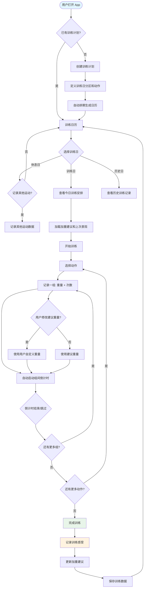

# Train Recorder — PRD Spec

> PRD Spec: defines WHAT the feature is and why it exists.

## Background

### Why (Reason)

力量举训练者依赖渐进式加重（Progressive Overload）来持续提升力量水平，但缺乏一个围绕这一核心理念设计的训练记录工具。当前用户使用纸质记录和记忆来管理训练，导致：(1) 无法基于历史数据做出加重决策；(2) 无法可视化进步趋势；(3) 训练安排缺乏系统化；(4) 训练感受无法追溯。随着训练水平提升，数据驱动的决策越来越重要，但现有工具要么面向泛健身用户功能臃肿，要么缺少关键的加重建议和分析能力。

### What (Target)

一个跨平台移动 App，提供力量举周期化训练的完整闭环：训练计划管理 → 训练执行与实时记录 → 渐进加重建议 → 历史数据与进步分析。同时支持其他运动（游泳等）的记录和身体数据追踪。数据存储在设备本地，离线可用。

### Who (Users)

| 角色                 | 描述                                                                            |
| -------------------- | ------------------------------------------------------------------------------- |
| 力量举训练者（主要） | 有经验的力量举爱好者，采用周期化推/拉/蹲训练方式，每周训练 3-4 次，追求渐进加重 |
| 其他运动爱好者       | 同时进行游泳、跑步等其他运动的健身者，需要记录非力量训练数据                    |

## Goals

| Goal             | Metric                                     | Notes    |
| ---------------- | ------------------------------------------ | -------- |
| 消除加重决策盲区 | 100% 的训练动作都有基于历史表现的加重建议  | 核心价值 |
| 可视化进步趋势   | 能查看任意动作的重量进步曲线和训练容量趋势 | 数据驱动 |
| 训练记录效率     | 记录一组数据 ≤ 2 次点击                    | 含预填充 |
| 训练节奏保障     | 组间计时器后台可靠运行，到时提醒           | 核心 UX  |
| 跨平台一致       | Android 和 iOS 核心体验一致                | 平台约束 |
| 替代纸质记录     | 创作者本人连续使用 ≥ 2 周                  | 自我验证 |

## Scope

### In Scope

- [x] 训练计划管理（周期化计划创建、推/拉/蹲分区、多模板切换）
- [x] 动作库（内置力量举动作 + 自定义动作 + 独立加重配置）
- [x] 训练执行与实时记录（逐组记录、组间计时器、到时提醒）
- [x] 渐进加重建议（基于表现的自动建议、每动作独立加重规则）
- [x] 训练日历（自动排期 + 可调整日期、训练类型标注）
- [x] 训练后感受记录（整体疲劳度、各动作感受、关联加重判断）
- [x] 历史数据与进步分析（训练历史、进步曲线、容量趋势、PR 追踪）
- [x] 身体数据记录（体重、围度、变化趋势）
- [x] 其他运动记录（自定义运动类型和指标）
- [x] 本地数据存储（数据导出功能）

### Out of Scope

- 云同步 / 多设备同步
- 社交功能（分享、好友对比、排行榜）
- 动作教学视频
- 营养/饮食记录
- Apple Watch / Wear OS 配套应用
- 付费/订阅功能
- 教练端功能

## Flow Description

### Business Flow Description

**核心训练闭环：**

1. **创建计划** — 用户创建一个训练计划，选择模式（固定周期或无限循环），定义训练日（推/拉/蹲分区），为每个训练日从动作库中选择动作并设置目标组数和次数。
2. **自动排期** — App 根据计划自动生成训练日历，标注每个训练日的训练类型。用户可调整具体日期。
3. **开始训练** — 用户在训练日打开 App，看到今日训练安排。App 根据上次每个动作的完成情况，自动建议本次目标重量。
4. **逐组记录** — 用户选择一个动作开始训练，按组输入实际重量和完成次数。记录完成后自动启动组间休息倒计时。
5. **计时提醒** — 倒计时到时后通过振动/声音提醒用户开始下一组。用户可在倒计时中提前开始或延长休息。
6. **完成动作** — 一个动作的所有组完成后，App 判断是否达成目标（目标次数全部完成 = 达成）。
7. **完成训练** — 所有动作完成后，用户记录整体训练感受（疲劳度、满意度）和各动作感受。
8. **加重判断** — App 根据各动作的完成情况更新加重建议：达成 → 下次加重，未达成 → 保持，连续两次未达成 → 建议减重 10%。
9. **回顾分析** — 用户在训练历史中查看各动作的进步曲线、容量趋势和个人记录。

**其他运动流程：**

用户可直接在日历中选择「其他运动」，选择运动类型（或自定义），录入相关指标（距离、时间等），保存后可在历史中查看。

**身体数据流程：**

用户在任何时候可录入身体数据（体重、围度），App 记录时间戳并生成变化趋势图。

### Business Flow Diagram

### Data Flow Description

本系统为单设备本地应用，无跨系统数据流。数据流均在设备内部完成。

## Functional Specs

### 5.1 训练日历页面

**Data Source**: 本地数据库中的训练计划排期 + 训练记录历史

**Display Scope**: 当月所有日期，标注训练类型

**Data Permissions**: 单用户，无权限区分

**Sort Order**: 按日期自然排序

**Page Type**: Dashboard（日历视图 + 当日摘要）

**Sample Data**:

| 日期              | 训练类型 | 状态   | 备注    |
| ----------------- | -------- | ------ | ------- |
| 2026-05-05 (周一) | 推日     | 已完成 | 卧推 PR |
| 2026-05-07 (周三) | 拉日     | 待训练 | —       |
| 2026-05-09 (周五) | 蹲日     | —      | —       |
| 2026-05-10 (周六) | 游泳     | 已完成 | 1500m   |

**Status Description**:

| Status Value      | Display Text   | Business Meaning                 |
| ----------------- | -------------- | -------------------------------- |
| completed         | 已完成         | 当日训练已完成并记录             |
| completed_partial | 已完成（部分） | 当日训练中途退出，部分动作已完成 |
| planned           | 待训练         | 计划中的训练日                   |
| skipped           | 已跳过         | 用户跳过了该训练日               |
| rest              | 休息           | 休息日                           |
| other_sport       | 其他运动       | 非力量训练的其他运动             |

**List Fields**:

| Field Name    | Type   | Description                            |
| ------------- | ------ | -------------------------------------- |
| date          | date   | 训练日期                               |
| training_type | string | 训练类型（推/拉/蹲/其他运动名称/休息） |
| status        | string | 训练状态                               |
| summary       | string | 训练摘要（如总容量、PR 等）            |

**Search Criteria**:

| #   | Search Field | Control Type | Description      | Default Placeholder |
| --- | ------------ | ------------ | ---------------- | ------------------- |
| 1   | 月份         | 日期切换     | 左右箭头切换月份 | 当前月份            |
| 2   | 训练类型     | 标签筛选     | 筛选特定训练类型 | 全部                |

### 5.2 训练执行页面

**Data Source**: 训练计划中当日的动作列表 + 上次训练记录（用于加重建议）

**Display Scope**: 当日训练的所有动作及每组记录

**Page Type**: Form page（逐组录入）

**功能描述**:

| 区域         | 内容                                                                |
| ------------ | ------------------------------------------------------------------- |
| 动作卡片列表 | 每个动作一个卡片，显示：动作名称、建议重量（可修改）、目标组数×次数 |
| 当前组记录区 | 当前正在进行的组：重量输入（预填充建议值）、实际次数输入、完成按钮  |
| 计时器区     | 组间休息倒计时显示，可暂停/跳过/延长                                |
| 训练进度     | 已完成动作数/总动作数                                               |

**交互流程**:

| #   | 操作                       | 系统响应                                             |
| --- | -------------------------- | ---------------------------------------------------- |
| 1   | 点击「开始训练」           | 加载今日动作列表，预填充建议重量，进入第一个动作     |
| 2   | 修改重量                   | 允许用户覆盖建议值，记录为自定义值                   |
| 3   | 输入次数并点击「完成本组」 | 保存本组数据，自动启动组间倒计时                     |
| 4   | 倒计时到时                 | 振动 + 声音提醒，显示「开始下一组」按钮              |
| 5   | 提前跳过计时               | 直接进入下一组记录                                   |
| 6   | 完成动作所有组             | 标记该动作完成，判断是否达成目标，显示下一个动作     |
| 7   | 所有动作完成               | 显示训练汇总（总容量、各动作完成情况），进入感受记录 |

#### 5.2.1 中途退出训练（US-10）

**Description**: 用户在训练过程中因故需要中途退出时，系统应保存已完成的数据，而不是丢弃。

**交互流程**:

| #   | 操作                    | 系统响应                                                 |
| --- | ----------------------- | -------------------------------------------------------- |
| 1   | 用户点击返回 / 退出训练 | 弹出确认对话框，提示「未完成的训练数据将保存为部分完成」 |
| 2   | 用户确认退出            | 保存所有已完成的组和动作数据                             |
| 3   | 保存完成                | 标记该次训练状态为「已完成（部分）」                     |

**Form Fields**:

| Field Name | Type   | Description                                |
| ---------- | ------ | ------------------------------------------ |
| 训练状态   | string | 已完成（部分）— 表示训练未全部完成但已保存 |

**业务规则**:

- 已完成（部分）状态在日历上用特殊标记显示（如半填充圆点），与正常完成（全填充）和未训练（空心）区分
- 加重算法仅纳入已完成的动作，未开始的动作不纳入加重判断
- 中途退出的训练记录在历史列表中标注「部分完成」标签

#### 5.2.2 动作顺序调整（US-16）

**Description**: 训练执行中允许用户调整动作顺序或跳过某个动作，以适应实际训练情况。

**交互流程**:

| #   | 操作               | 系统响应                                     |
| --- | ------------------ | -------------------------------------------- |
| 1   | 长按动作卡片       | 触发拖动模式，动作卡片可上下拖动             |
| 2   | 拖动动作到目标位置 | 调整动作执行顺序                             |
| 3   | 向左滑动动作卡片   | 显示「跳过」操作按钮                         |
| 4   | 点击「跳过」       | 该动作标记为「已跳过」，自动切换到下一个动作 |
| 5   | 点击已跳过的动作   | 显示「取消跳过」按钮，点击后可开始记录该动作 |

**业务规则**:

- 跳过的动作在动作列表中灰显并标记「已跳过」状态
- 已跳过的动作不计入训练进度百分比
- 用户可在训练中随时取消跳过，取消后动作恢复为待完成状态
- 动作顺序调整仅在本次训练生效，不影响训练计划中的原始顺序

#### 5.2.3 同一动作在同一训练日出现多次（US-17）

**Description**: 允许同一动作在同一天的训练计划中出现多次，每次有独立的加重建议和备注。

**Form Fields**:

| Field Name | Control Type | Required | Rules                                                        |
| ---------- | ------------ | -------- | ------------------------------------------------------------ |
| 动作备注   | 文本输入     | 否       | 最大 50 字，用于区分同一动作的不同出现，如"暂停深蹲"、"窄距" |

**交互流程**:

| #   | 操作                             | 系统响应                                         |
| --- | -------------------------------- | ------------------------------------------------ |
| 1   | 用户在计划编辑中添加同一动作两次 | 系统允许重复添加，每次生成独立的动作实例         |
| 2   | 训练执行中显示重复动作           | 每次出现显示为独立卡片，显示备注（如有）以区分   |
| 3   | 完成第一次出现                   | 该实例标记完成，加重建议更新；第二次出现保持独立 |

**业务规则**:

- 同一动作的每次出现有独立的加重建议链，互不影响
- 每次出现可设置不同的目标组数和次数
- 在训练执行页面中，通过序号和备注区分（如"深蹲 #1"、"深蹲 #2 - 暂停深蹲"）
- 历史记录和进步分析中，同一动作的所有出现合并展示，但可通过备注筛选

#### 5.2.4 后台计时器可靠性（US-11）

**Description**: 训练中的组间休息计时器在 App 切到后台、锁屏或被系统中断后仍能可靠运行。

**交互流程**:

| #   | 场景                   | 系统响应                                                               |
| --- | ---------------------- | ---------------------------------------------------------------------- |
| 1   | 用户按 Home 键切到后台 | 计时器继续运行，通知栏显示倒计时剩余时间和「开始下一组」按钮           |
| 2   | 锁屏状态               | 锁屏通知显示倒计时剩余，倒计时结束时触发振动+声音提醒                  |
| 3   | 来电或其他中断         | 中断结束后自动恢复计时，继续倒计时                                     |
| 4   | App 被系统强制关闭     | 重新打开 App 时，基于保存的时间戳（开始时间+总时长）计算剩余时间并恢复 |

**业务规则**:

- 计时器基于时间戳（而非相对倒计时）运行，确保系统时间准确即可恢复
- 后台运行使用系统级本地通知（Local Notification）实现，无需网络
- 通知栏显示格式：「组间休息 · 剩余 1:30」
- 计时器状态在每次变化时持久化到本地存储（开始时间戳、总时长）
- 强制关闭后恢复时，若已超过计时总时长，直接触发提醒

### 5.3 渐进加重建议逻辑

**加重规则（每个动作独立配置）**:

| 动作完成情况              | 加重建议                       | 说明                     |
| ------------------------- | ------------------------------ | ------------------------ |
| 所有组均完成目标次数      | 建议加重（按该动作配置的增量） | 如深蹲 +5kg，卧推 +2.5kg |
| 部分组未完成目标次数      | 保持当前重量                   | 不加重也不减重           |
| 连续 2 次训练均有组未完成 | 建议减重 10%                   | 可能训练过量             |
| 连续 3 次训练均完成       | 可考虑加大增量                 | 可选功能，用户可忽略     |

**加重增量配置（动作级别）**:

| Field Name         | Control Type | Required | Default | Rules                             |
| ------------------ | ------------ | -------- | ------- | --------------------------------- |
| 加重增量           | 数字输入     | 是       | 2.5kg   | > 0，支持小数（0.5/1/1.25/2.5/5） |
| 目标组数           | 数字输入     | 是       | —       | 1-10                              |
| 目标次数（每组）   | 数字输入     | 是       | —       | 1-30                              |
| 组间休息时长（秒） | 数字输入     | 是       | 180     | 30-600                            |

### 5.4 训练后感受记录

**Form Fields**:

| Field Name | Control Type       | Required | Max Length | Rules                   |
| ---------- | ------------------ | -------- | ---------- | ----------------------- |
| 整体疲劳度 | 滑块评分（1-10）   | 是       | —          | 1=极度轻松，10=筋疲力尽 |
| 训练满意度 | 滑块评分（1-10）   | 是       | —          | 1=很差，10=完美         |
| 各动作感受 | 多行文本（每动作） | 否       | 200 字     | 自由文本                |
| 备注       | 多行文本           | 否       | 500 字     | 自由文本                |

**加重关联**: 当疲劳度 ≥ 8 且满意度 ≤ 4 时，下次训练建议降低强度或休息。

### 5.5 动作库

**Data Source**: 预置动作列表 + 用户自定义动作

**内置动作分类**（共 7 类）:

| 分类       | 动作                                   |
| ---------- | -------------------------------------- |
| 核心力量举 | 深蹲、卧推、硬拉、推举                 |
| 上肢推     | 上斜卧推、哑铃卧推、双杠臂屈伸         |
| 上肢拉     | 杠铃划船、引体向上、高位下拉、哑铃划船 |
| 下肢       | 前蹲、腿举、罗马尼亚硬拉、腿弯举       |
| 核心       | 卷腹、平板支撑、健腹轮                 |
| 肩部       | 侧平举、面拉、推举（哑铃）             |
| 自定义     | 用户自行创建的动作                     |

**动作属性**:

| Field Name   | Type    | Description          |
| ------------ | ------- | -------------------- |
| name         | string  | 动作名称             |
| category     | string  | 所属分类             |
| increment    | number  | 默认加重增量（kg）   |
| default_rest | number  | 默认组间休息（秒）   |
| is_custom    | boolean | 是否为用户自定义动作 |

### 5.6 历史数据与进步分析

**训练历史列表**:

| Field Name   | Type   | Description      |
| ------------ | ------ | ---------------- |
| date         | date   | 训练日期         |
| type         | string | 训练类型         |
| exercises    | string | 包含的动作列表   |
| total_volume | number | 总容量（kg）     |
| duration     | number | 训练时长（分钟） |
| feeling      | number | 感受评分         |

**进步曲线图**: X 轴为日期，Y 轴为重量（kg），每个动作一条线。标注 PR（个人记录）点。

**容量趋势图**: X 轴为日期，Y 轴为总容量（kg），柱状图展示每次训练容量。

**PR 追踪**: 记录每个动作的历史最高重量和最高容量，在新 PR 产生时提醒用户。

#### 5.6.1 编辑和删除历史训练记录（US-12）

**Description**: 允许用户编辑或删除历史训练记录，以修正录入错误或移除无效数据。

**交互流程**:

| #   | 操作                         | 系统响应                                         |
| --- | ---------------------------- | ------------------------------------------------ |
| 1   | 在训练详情页点击「编辑」按钮 | 进入编辑模式，允许修改重量、次数等数据           |
| 2   | 修改数据并保存               | 保存修改，自动重算相关动作的加重建议             |
| 3   | 在训练详情页点击「删除」按钮 | 弹出二次确认对话框，提示「删除后无法恢复」       |
| 4   | 确认删除                     | 删除该条训练记录，若包含 PR 则自动回退到次优记录 |

**Form Fields（编辑模式）**:

| Field Name   | Control Type | Required | Rules                |
| ------------ | ------------ | -------- | -------------------- |
| 重量（每组） | 数字输入     | 是       | 与训练执行页一致     |
| 次数（每组） | 数字输入     | 是       | 1-30                 |
| 训练感受     | 滑块评分     | 否       | 与训练后感受记录一致 |

**业务规则**:

- 编辑训练记录后，系统自动从该记录起重新计算加重建议链（即该记录之后的所有加重建议可能变化）
- 删除包含 PR（个人记录）的记录后，PR 自动回退到历史次优记录，并提示用户新的 PR 值
- 删除操作不可撤销，需二次确认
- 编辑和删除操作记录在本地日志中，便于数据审计

#### 5.6.2 补录过去的训练记录（US-13）

**Description**: 允许用户为过去的日期补录训练数据，适用于忘记记录或从其他工具迁移数据的场景。

**交互流程**:

| #   | 操作                         | 系统响应                                       |
| --- | ---------------------------- | ---------------------------------------------- |
| 1   | 在日历上选择过去的无训练日期 | 显示「补录训练」选项（与正常的训练日操作并列） |
| 2   | 点击「补录训练」             | 进入补录流程，选择训练类型和动作               |
| 3   | 录入各动作的组和次数         | 与正常训练录入类似，但无组间倒计时             |
| 4   | 保存补录记录                 | 保存数据，从补录日期起自动重算加重建议链       |

**Form Fields**:

| Field Name | Control Type | Required | Rules                          |
| ---------- | ------------ | -------- | ------------------------------ |
| 训练日期   | 日期选择     | 是       | 默认为选中的日期，不可超过今天 |
| 训练类型   | 单选         | 是       | 从已有训练计划中选择           |
| 动作列表   | 列表编辑     | 是       | 选择动作并录入每组数据         |

**业务规则**:

- 补录流程与正常训练类似，但跳过组间倒计时功能（不可能回顾性计时）
- 补录完成后，系统从补录日期开始向前重算加重建议链（后续训练的加重建议可能变化）
- 补录记录在历史列表中标注「补录」标签，与实时记录区分
- 不允许补录未来的日期

### 5.7 身体数据记录

**Form Fields**:

| Field Name   | Control Type | Required | Rules       |
| ------------ | ------------ | -------- | ----------- |
| 记录日期     | 日期选择     | 是       | 默认今天    |
| 体重（kg）   | 数字输入     | 是       | 精确到 0.1  |
| 胸围（cm）   | 数字输入     | 否       | 精确到 0.1  |
| 腰围（cm）   | 数字输入     | 否       | 精确到 0.1  |
| 臂围（cm）   | 数字输入     | 否       | 精确到 0.1  |
| 大腿围（cm） | 数字输入     | 否       | 精确到 0.1  |
| 备注         | 文本         | 否       | 最大 200 字 |

**趋势图**: 各指标随时间变化的折线图。

### 5.8 其他运动记录

**运动类型配置**:

| Field Name | Control Type | Required | Rules                    |
| ---------- | ------------ | -------- | ------------------------ |
| 运动名称   | 文本输入     | 是       | 如：游泳、跑步、骑行     |
| 记录指标   | 多选配置     | 是       | 从预设指标中选择或自定义 |

**预设指标**: 距离、时间、配速、趟数、心率、卡路里、自定义数值

**记录表单**: 根据选择的指标动态生成对应输入字段。

### 5.9 训练计划管理

**创建计划表单**:

| Field Name           | Control Type     | Required | Rules                                     |
| -------------------- | ---------------- | -------- | ----------------------------------------- |
| 计划名称             | 文本输入         | 是       | 如：5/3/1 周期、得州方法                  |
| 计划模式             | 单选             | 是       | 固定周期 / 无限循环                       |
| 周期长度（固定模式） | 数字输入         | 条件必填 | 1-12 周                                   |
| 排期方式             | 单选             | 是       | 每周固定日 / 固定天数间隔                 |
| 训练日定义           | 列表编辑         | 是       | 每行：训练类型 + 选择动作 + 目标组数×次数 |
| 动作模式             | 单选（每个动作） | 是       | 固定模式 / 自定义模式（见下方说明）       |

**动作模式说明**:

每个动作支持两种模式：

| 模式       | 说明                     | 适用场景                           | 示例                                                        |
| ---------- | ------------------------ | ---------------------------------- | ----------------------------------------------------------- |
| 固定模式   | 统一的组数、次数、重量   | 适合线性加重，每次训练使用相同参数 | 3组×8次@60kg，下次加重到 3组×8次@62.5kg                     |
| 自定义模式 | 逐组设置不同的重量和次数 | 适合非线性加重方案，每组参数可不同 | 5/3/1 方案：第1组 5次@80kg、第2组 3次@90kg、第3组 1次@100kg |

在训练计划中为每个动作选择模式后：

- 固定模式：用户输入统一的组数、目标次数、起始重量，训练时每组使用相同参数
- 自定义模式：用户为每一组单独设置目标次数和重量，训练时按预设的逐组参数执行

**排期方式详细规则**:

| 排期方式     | 配置项                                   | 排期逻辑                                             | 示例                                              |
| ------------ | ---------------------------------------- | ---------------------------------------------------- | ------------------------------------------------- |
| 每周固定日   | 选择每周几训练，为每个训练日分配训练类型 | 每周重复相同安排，非训练日自动标记为休息             | 周一推、周三拉、周五蹲，其余休息                  |
| 固定天数间隔 | 设置训练间隔天数（训练后休息几天再训练） | 按训练日顺序循环，每个训练日之间插入指定天数的休息日 | 间隔1天：训练(推)、休息、训练(拉)、休息、训练(蹲) |

**自动排期规则**:

- 固定周期模式：按周期长度和排期方式生成完整排期，周期结束后重新开始
- 无限循环模式：按排期方式无限循环生成排期
- 每周固定日模式下，每个工作日只能关联一个训练日（推/拉/蹲/自定义）
- 固定天数间隔模式下，间隔天数范围 0-6 天（0 = 每天训练，1 = 练一天休一天）
- 用户可在日历上拖动调整已排期的训练日期

### 5.10 统计概览

**Data Source**: 本地数据库中的训练记录 + 训练计划排期 + PR 记录

**Display Scope**: 本周/本月汇总数据，近 8 周容量趋势，近 4 周训练频率

**Data Permissions**: 单用户，无权限区分

**Sort Order**: Hero 卡片 → 四宫格汇总 → 周容量柱状图 → 个人记录列表 → 训练频率热力图

**Page Type**: Dashboard（宏观训练概览仪表盘）

**Sample Data**:

| 区域         | 示例内容                                                                                                        |
| ------------ | --------------------------------------------------------------------------------------------------------------- |
| Hero 卡片    | 本周训练容量 18,450 kg，周环比 ↑12%                                                                             |
| 四宫格       | 本周训练 3 次（目标 3 次）、本月训练 11 次（连续 4 周）、总训练时长 4.5h（本周累计）、个人记录 2 PR（本月新增） |
| 周容量柱状图 | 近 8 周柱状图，本周高亮                                                                                         |
| 个人记录     | 卧推 1RM 80kg（5月5日）、深蹲 1RM 120kg（5月2日）、硬拉 1RM 140kg（4月28日）                                    |
| 热力图       | 近 4 周活动方块图，深浅表示训练强度                                                                             |

**Status Description**:

| Status Value | Display Text                 | Business Meaning         |
| ------------ | ---------------------------- | ------------------------ |
| no_data      | 提示「完成你的第一次训练」   | 首次使用，无任何训练记录 |
| has_data     | 完整仪表盘，展示所有统计模块 | 有至少 1 条训练记录      |

**Form Fields**:

| Field Name        | Type   | Description                                                      | Display Area        |
| ----------------- | ------ | ---------------------------------------------------------------- | ------------------- |
| weekly_volume     | number | 本周训练总容量（Σ 重量×次数）                                    | Hero 卡片主值       |
| weekly_change_pct | number | 周环比变化百分比（正=升/负=降）                                  | Hero 卡片副标签     |
| weekly_sessions   | number | 本周训练次数                                                     | 四宫格卡片 1        |
| weekly_target     | number | 本周训练目标次数                                                 | 四宫格卡片 1 副文本 |
| monthly_sessions  | number | 本月训练次数                                                     | 四宫格卡片 2        |
| consecutive_weeks | number | 连续训练周数                                                     | 四宫格卡片 2 副文本 |
| weekly_duration   | number | 本周总训练时长（小时）                                           | 四宫格卡片 3        |
| monthly_pr_count  | number | 本月新增 PR 数量                                                 | 四宫格卡片 4        |
| week_volumes      | array  | 近 8 周各周容量 [{week_label, volume}]                           | 周训练容量柱状图    |
| pr_records        | array  | 各动作 1RM 估测及达成日期 [{exercise_name, estimated_1rm, date}] | 个人记录列表        |
| frequency_heatmap | array  | 近 28 天每日训练强度 [{date, intensity, is_planned}]             | 训练频率热力图      |

**Search Criteria**:

本页为自动汇总仪表盘，无用户手动搜索条件。所有数据根据当前日期自动计算：

- 本周 = 当前自然周（周一至周日）
- 本月 = 当前自然月
- 近 8 周 = 当前周往前推 8 周
- 近 4 周（热力图）= 当前日期往前推 28 天

**Validation Rules**:

- 周环比计算公式：本周容量 / 上周容量 - 1；上周无数据时周环比显示「--」
- 1RM 估测公式：实际重量 × (1 + 实际次数 / 30)，基于训练中最大重量组计算
- 热力图强度分级：休息日=0.1，轻度训练=0.4-0.6，中度训练=0.7-0.8，重度训练=0.9+
- 热力图中计划内但未完成的日期用蓝色边框标注，与已完成日期的绿色填充区分
- 点击「查看全部」跳转历史页 PR 面板（Tab 3 - PR 子面板）

**交互流程**:

| #   | 操作                | 系统响应                                                                          |
| --- | ------------------- | --------------------------------------------------------------------------------- |
| 1   | 进入统计页（Tab 4） | 加载并展示完整统计仪表盘                                                          |
| 2   | 查看 Hero 卡片      | 显示本周训练容量 + 周环比变化（上升绿色、下降红色）                               |
| 3   | 查看四宫格汇总      | 展示本周训练次数（含目标）、本月训练次数（含连续周数）、本周训练时长、本月新增 PR |
| 4   | 查看周容量柱状图    | 近 8 周柱状图，本周高亮为主题色，其他周为灰色，上周绿色边框                       |
| 5   | 查看个人记录列表    | 展示各动作 1RM 估测及达成日期，最多显示 4 条                                      |
| 6   | 点击「查看全部」    | 跳转历史页 PR 面板                                                                |
| 7   | 查看训练频率热力图  | 近 4 周活动方块图，深浅表示训练强度，计划中日期蓝色边框标注                       |

### 5.11 设置

**Data Source**: 本地存储的用户偏好配置 + 应用状态

**Display Scope**: 训练偏好配置、提醒设置、数据管理、关于信息

**Data Permissions**: 单用户，无权限区分

**Page Type**: Settings page（分组列表）

**Sample Data**:

| 设置分组 | 设置项         | 当前值                  |
| -------- | -------------- | ----------------------- |
| 训练设置 | 动作库管理     | 19 个动作（跳转子页面） |
| 训练设置 | 重量单位       | 公斤 (kg)               |
| 训练设置 | 默认休息时间   | 180 秒                  |
| 提醒     | 训练提醒       | 开启                    |
| 提醒     | 休息结束振动   | 开启                    |
| 提醒     | 休息结束提示音 | 关闭                    |
| 数据管理 | 导出训练数据   | —                       |
| 数据管理 | 导入训练数据   | —                       |
| 关于     | 新手引导       | —                       |
| 关于     | 给 App 评分    | —                       |
| 关于     | 反馈与建议     | —                       |

**Status Description**:

| Status Value   | Display Text                                                 | Business Meaning     |
| -------------- | ------------------------------------------------------------ | -------------------- |
| default        | 设置列表正常展示                                             | 进入页面默认状态     |
| export_confirm | 底部弹出导出范围选择面板（全部数据/最近 3 个月/最近 6 个月） | 点击「导出训练数据」 |
| clear_confirm  | 底部弹出警告确认面板，提示不可撤销                           | 点击「清除所有数据」 |
| import_confirm | 底部弹出导入确认面板，提示数据合并说明                       | 点击「导入训练数据」 |

**Form Fields**:

| Field Name     | Control Type       | Required | Default   | Rules                                                |
| -------------- | ------------------ | -------- | --------- | ---------------------------------------------------- |
| 重量单位       | 单选切换（kg/lbs） | 是       | 公斤 (kg) | 二选一，切换后全局生效（训练记录、统计页等）         |
| 默认休息时间   | 列表选择           | 是       | 180 秒    | 可选值：90/120/180/240/300 秒，仅影响新建训练计划    |
| 训练提醒       | 开关（Toggle）     | 否       | 开启      | 控制训练日当天是否推送提醒通知                       |
| 休息结束振动   | 开关（Toggle）     | 否       | 开启      | 控制组间倒计时结束时是否振动                         |
| 休息结束提示音 | 开关（Toggle）     | 否       | 关闭      | 控制组间倒计时结束时是否播放提示音                   |
| 导出范围       | 列表选择           | 条件必填 | —         | 仅导出时显示，可选：全部数据/最近 3 个月/最近 6 个月 |

**Validation Rules**:

- 重量单位切换立即生效，历史记录不进行单位转换（仅改变显示单位）
- 默认休息时间仅影响新创建的训练计划，已有计划不受影响
- 导出数据格式为 JSON，包含训练记录、计划、身体数据、动作库、设置
- 导入数据时与现有数据合并：相同 ID 的记录以导入数据为准，新增记录直接添加
- 清除所有数据操作不可撤销，必须通过底部弹出面板二次确认
- 清除范围包括：所有训练记录、训练计划、身体数据、PR 记录；保留动作库和用户偏好设置
- 「给 App 评分」跳转应用商店页面
- 「反馈与建议」打开邮件客户端或反馈表单

**交互流程**:

| #   | 操作                         | 系统响应                                          |
| --- | ---------------------------- | ------------------------------------------------- |
| 1   | 进入设置页（Tab 5）          | 显示应用信息 + 分组设置列表                       |
| 2   | 点击「动作库管理」           | 跳转动作库页面（exercise-library.html）           |
| 3   | 点击「重量单位」             | 循环切换 kg ↔ lbs，Toast 提示「单位已切换为 xxx」 |
| 4   | 点击「默认休息时间」         | 底部弹出选择面板，列出 90/120/180/240/300 秒选项  |
| 5   | 切换训练提醒/振动/提示音开关 | 开关状态立即保存                                  |
| 6   | 点击「导出训练数据」         | 底部弹出导出范围选择面板（全部/3 个月/6 个月）    |
| 7   | 选择导出范围并确认           | 生成 JSON 文件，Toast 提示「数据导出成功」        |
| 8   | 点击「导入训练数据」         | 底部弹出确认面板，说明数据合并规则                |
| 9   | 确认导入并选择文件           | 读取文件并合并数据，Toast 提示「导入成功」        |
| 10  | 点击「清除所有数据」         | 底部弹出警告面板，提示不可撤销                    |
| 11  | 确认清除                     | 清除所有训练数据，Toast 提示「数据已清除」        |
| 12  | 点击「新手引导」             | 重新播放首次使用引导流程                          |
| 13  | 点击「给 App 评分」          | 跳转应用商店评分页                                |
| 14  | 点击「反馈与建议」           | 打开反馈渠道                                      |

#### 5.11.1 数据导出（US-14）

**Description**: 允许用户将所有训练数据导出为标准格式文件，用于备份或迁移到其他工具。

**交互流程**:

| #   | 操作                     | 系统响应                                             |
| --- | ------------------------ | ---------------------------------------------------- |
| 1   | 在设置页点击「导出数据」 | 显示导出选项（格式选择、日期范围）                   |
| 2   | 选择导出格式和范围       | 生成导出文件                                         |
| 3   | 导出完成                 | 显示分享对话框，用户可选择保存到本地或分享到其他应用 |

**Form Fields**:

| Field Name | Control Type | Required | Default | Rules                                |
| ---------- | ------------ | -------- | ------- | ------------------------------------ |
| 导出格式   | 单选         | 是       | CSV     | 可选：CSV / JSON                     |
| 日期范围   | 日期区间     | 否       | 全部    | 可选择起止日期                       |
| 数据范围   | 多选         | 否       | 全选    | 可选：训练记录 / 身体数据 / 其他运动 |

**业务规则**:

- 导出包含所有训练记录、身体数据和其他运动数据
- CSV 格式兼容主流表格软件（Excel、Google Sheets）
- JSON 格式保留完整数据结构，可用于后续版本的数据导入
- 大数据量导出时显示进度条

#### 5.11.2 重量单位切换（US-15）

**Description**: 允许用户在公斤（kg）和磅（lb）之间切换重量显示单位，满足不同地区用户的使用习惯。

**交互流程**:

| #   | 操作                     | 系统响应                                                      |
| --- | ------------------------ | ------------------------------------------------------------- |
| 1   | 在设置页点击「重量单位」 | 显示单位选择：公斤 / 磅                                       |
| 2   | 选择目标单位             | 全 App 所有重量显示立即切换为目标单位，数据按换算比例转换显示 |

**Form Fields**:

| Field Name | Control Type | Required | Default | Rules         |
| ---------- | ------------ | -------- | ------- | ------------- |
| 重量单位   | 单选         | 是       | kg      | 可选：kg / lb |

**业务规则**:

- 内部存储统一使用 kg，单位切换仅影响显示层
- 换算比例：1 kg = 2.20462 lb
- 切换单位后，所有页面的重量显示立即更新（日历、训练执行、历史记录、进步曲线等）
- 加重增量配置中的单位同步切换
- 输入重量时按当前选择的单位输入，存储时自动转换为 kg

#### 5.11.3 首次使用引导（US-18）

**Description**: 首次打开 App 时显示引导流程，帮助用户快速上手并创建第一个训练计划。

**交互流程**:

| #   | 步骤           | 内容                                                        |
| --- | -------------- | ----------------------------------------------------------- |
| 1   | 欢迎页         | 显示 App 简介和核心功能介绍（渐进加重、训练记录、进步分析） |
| 2   | 创建第一个计划 | 引导用户创建训练计划，提供模板推荐                          |
| 3   | 选择动作       | 为计划中的训练日选择动作，提供常用动作预填充                |
| 4   | 完成           | 显示「开始训练」入口，进入训练日历                          |

**计划模板推荐**:

| 模板名称      | 训练日安排                    | 适用人群             |
| ------------- | ----------------------------- | -------------------- |
| 推拉蹲（PPL） | 推日 / 拉日 / 蹲日，3天一循环 | 力量举爱好者，最常用 |
| 上下肢分化    | 上肢日 / 下肢日，2天一循环    | 健身入门者           |
| 全身训练      | 全身日，每次练全身            | 新手或时间有限者     |

**常用动作预填充**:

- 推日预填充：卧推、上斜卧推、哑铃飞鸟、三头下压
- 拉日预填充：硬拉、杠铃划船、引体向上、二头弯举
- 蹲日预填充：深蹲、前蹲、腿举、腿弯举

**业务规则**:

- 引导流程仅在首次使用时显示，完成后不再出现
- 用户可跳过引导，稍后在训练计划管理中手动创建计划
- 模板仅作为初始参考，用户可自由修改（增删动作、调整组数次数等）
- 预填充的动作携带默认的加重增量和组间休息时长

## Other Notes

### Performance Requirements

- Response time: 训练中操作响应 ≤ 200ms
- Concurrency: 单用户，无并发需求
- Data storage: 本地数据库，预估单用户年数据量 < 10MB
- Compatibility: Android 8.0+ / iOS 15.0+，支持主流屏幕尺寸

### Data Requirements

- Data tracking: 所有训练数据带时间戳，支持精确到秒的训练时长记录
- Data initialization: 首次使用提供引导流程：创建第一个训练计划、录入当前力量水平
- Data migration: 支持数据导出为标准格式，后续版本可导入

### Security Requirements

- Transport encryption: 不适用（纯本地存储，无网络传输）
- Storage encryption: 训练数据为个人隐私数据，建议使用设备级加密存储
- Display masking: 不适用
- Rate limiting: 不适用

---

## Quality Checklist

- [x] Is the requirement title accurate and descriptive
- [x] Does the background include all three elements: reason, target, users
- [x] Are the goals quantified
- [x] Is the flow description complete
- [x] Does the business flow diagram exist (Mermaid format)
- [x] Is the list page description complete (data source / display scope / permissions / sorting / pagination / fields / search)
- [x] Are button actions described completely (permissions / states / validation / data logic)
- [x] Are form descriptions complete (fields / validation rules)
- [x] Are related changes thoroughly analyzed
- [x] Are non-functional requirements considered (performance / data / monitoring / security)
- [x] Are all tables filled completely
- [x] Is there any ambiguous or vague wording
- [x] Is the spec actionable and verifiable
